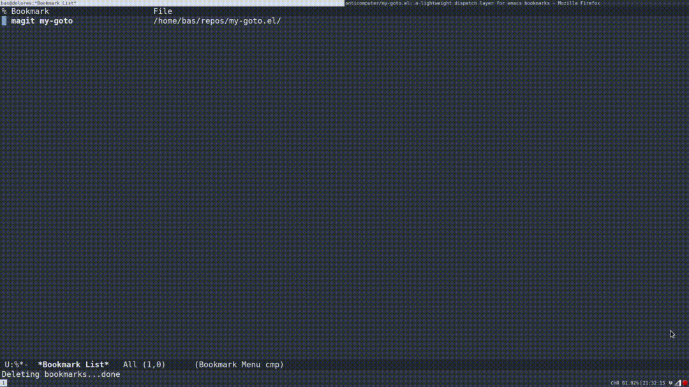

*DISCLAIMER: before you grab this ... if you're like me, you might know about emacs `bookmark` but not about [bookmark+](https://www.emacswiki.org/emacs/BookmarkPlus) (thanks to jwiegley for the heads up on that) ... `bookmark+` can do all of what my-goto.el does and might be much better suited for your personal workflow. This package is pretty uniquely specific to how I like to interact with emacs.*

# my/goto: I wanna go fast!



## Why?

This is a simple package that aims to remove stutter from workflows that require you to revisit the same locations many times over the course of a day.

Things like:

- the issues page for your project
- that one remote system you need to pop into a shell on
- that google doc with the team meeting notes
- your github notifications
- ...

You get the idea.

It integrates with emacs built-in `bookmark` to provide custom dispatchers on top of the stock emacs bookmarks. The idea here is that you often want to step outside of emacs without having to step outside of emacs. By providing a custom dispatch layer we can make our bookmarks do things beyond just jumping to file markers.

Stock emacs `bookmark` already supports file buffers, dired buffers, and magit status buffers just fine. For my use case I really just needed a way to shortcut to URLs and pop into a remote eshell (the latter you can also achieve with `eshell-bookmark`).

## How?

At this point `my/goto` is a very lightweight alternative to `bookmark+`. It provides a simple way to set custom dispatchers for locations, but still uses the stock `bookmark` package to manage the actual bookmarks. All the stock `bookmark` bindings work and you can just use `bookmark-jump` to narrow to and visit a location.

You can configure `my/goto` in a variety of ways. My personal configuration currently looks like this:

```
(use-package bookmark
  :bind ("C-x j" . bookmark-jump)
  :config
  (setq bookmark-save-flag nil)
  (cond ((eq my/location 'home)
         (setq bookmark-default-file "~/emacs/config/bookmarks-home.gpg"))
        ((eq my/location 'work)
         (setq bookmark-default-file "~/emacs/config/bookmarks-work.gpg"))))

(use-package my-goto
  :ensure t
  :commands (my/goto-bookmark-location
             my/goto-bookmark-handler
             my/goto-bookmark-url-at-point)
  :bind (("C-x y" . my/goto-bookmark-location)
         ("C-x p" . my/goto-bookmark-url-at-point))
  :quelpa (my-goto
           ;;:fetcher file
           ;;:path "~/repos/my-goto.el"
           :fetcher github
           :repo "anticomputer/my-goto.el"
           :files ("my-goto.el"))
  :after bookmark)
```

Default location classes are: `:eshell` and `:uri` which dispatch to `eshell` (with `default-directory` set to location) and `browse-url`, respectively.

Note that any scheme that is natively supported by emacs for files and uris will of course just work (e.g. tramp ssh paths) since the dispatchers are just wrappers around the regular emacs interfaces.

E.g. you can set an `:eshell` bookmark to `/ssh:host:/path` and thanks to tramp you will have a bookmark into a remote shell.

You can still mix in and use standard emacs bookmarks. `my/goto` bookmarks get their own handlers assigned and they should not interfere with your existing `bookmark` use cases.

You can add `my/goto` dispatch enabled bookmarks via `M-x my/goto-bookmark-location RET`. Please remember that, since we're using the stock `bookmark` package, if you want them to persist you have to actually save state on your bookmarks after adding them with e.g. `M-x bookmark-save RET`.

Setting a label is optional, but they make sense to use when you e.g. want to include ugly google doc links and other things that don't really provide directly identifying information.

In my config I have fuzzy matching configured for ido and `ido-completing-read+` configured in ubiquitous mode. This allows me to very rapidly narrow when I use a consistent labeling scheme. This in turn provides a naturally mnemonic workflow that has a visual feedback loop that prevents stutter.

## Adding your own dispatchers

- 1: add your class keyword and associated location reader to the `my/goto-classes` alist
- 2: implement your class dispatcher as a method for the `my/goto-dispatch` generic

e.g. to add a dispatcher for `:yourclass` in your config you can go:

```
;; 1
(cl-pushnew '(:yourclass . read-file-name) my/goto-classes)

;; 2
(cl-defmethod my/goto-dispatch ((class (eql :yourclass)) goto)
  "Visit GOTO based on CLASS."
  (your-dispatcher-code goto))

```

If you don't set a location reader, i.e. you just push `'(:yourclass)`, `my/goto` will default to using `read-string`. If you have a custom location reader that you want to use it needs to take a single `PROMPT` argument to be compatible.

## Dependencies

I wanted this to work with stock emacs, so it only depends on `bookmark`, `cl-lib` and `url-util`.
